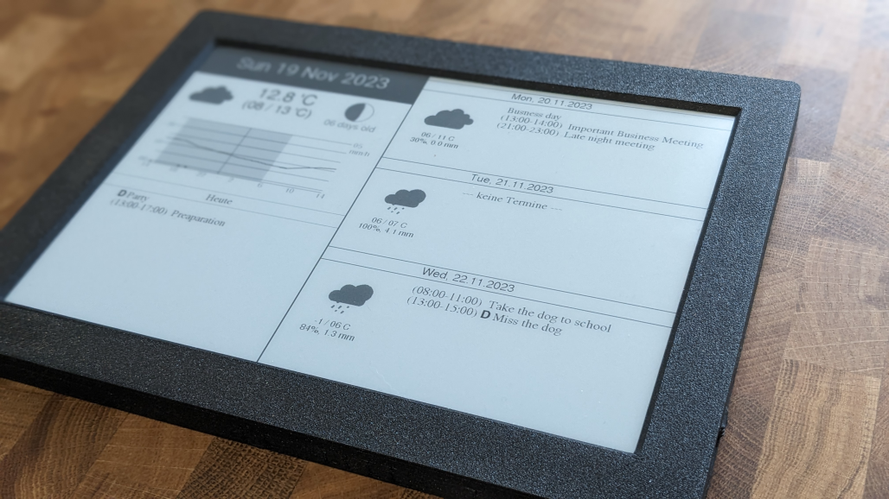
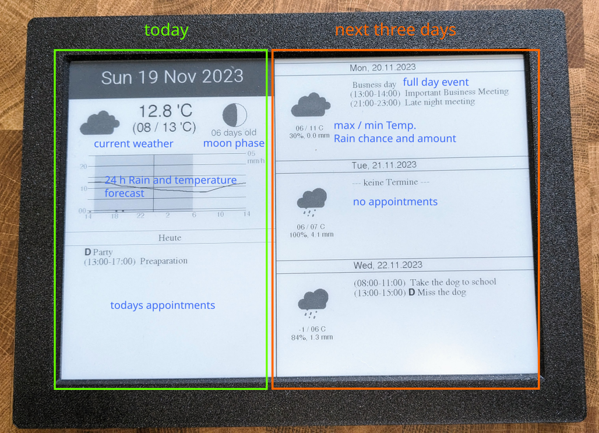

# Inkplate Hub

Inkplate display that shows the appointments from a google Calendar and weather for the current and next three days. The temperature and rain for the next 24 h is displayed as well.

Data is fetched through Wifi from google and openweathermap.org, using the OneCall API.
The screen refreshes each hour and then goes to sleep to save energy. Battery is expected to last several months.

## Materials

- [Inkplate 10](https://soldered.com/product/inkplate-10-9-7-e-paper-board-copy/) by soldered.com

## How to build

- Make an account at https://openweathermap.org/ and sign up to the [OneCall Subscription](https://openweathermap.org/api/one-call-3) (1000 Calls per day are for free, I suggest you limit the calls that are possible to 900, to be safe)
- Install library ArduinoJson
- Follow the guide [here](https://github.com/SolderedElectronics/Inkplate-Arduino-library) to set up your Inkboard
- Put your information in credentials_example.h (Wifi password, location for weather, calendar urls) and rename file to credentials.h
- upload inkplate_hub.ino to the Inkplate esp32

## Acknowledgement

This code heavily uses the two examples given by soldered.com:

- [Google Calendar](https://github.com/SolderedElectronics/Inkplate-Arduino-library/tree/master/examples/Inkplate10/Projects/Inkplate10_Google_Calendar)
- [Openweather Station](https://github.com/SolderedElectronics/Inkplate-Arduino-library/tree/master/examples/Inkplate10/Projects/Inkplate10_OpenWeather_Station)

Thanks for soldered.com for these educational examples and the support they offered by email.

The interpretation of the openweather API is done by the library by [Jessica Hersey](https://github.com/JHershey69) available [here](https://github.com/JHershey69/OpenWeatherOneCall).

The fonts used are given by [Adafruit GFX](https://github.com/adafruit/Adafruit-GFX-Library).

Inspration was taken from these awesome projects:

- [MagInkDash](https://github.com/speedyg0nz/MagInkDash) by speedyg0nz
- [Inkplate 10 Weather Calendar](https://github.com/chrisjtwomey/inkplate10-weather-cal) by chrisjtwomey
- [inkycal](https://github.com/aceinnolab/Inkycal) by aceisace

## Known problems

- The code is a mess, sorry
- Uses outdated (but working) version of OpenWeatherOneCall library
- Repeating calendar dates will not be displayed (except for yearly repeating)
- can not typeset Umlaute, nor ° symbol
- long entry names will mess up the layout on the current day
- can not handle daylight saving time
